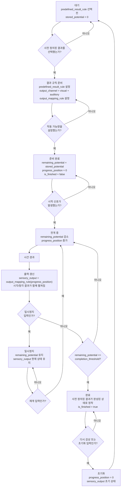

# Hourglass + Music Box 플로우차트 v0.1

## 인터페이스 개요

사용자가 사전에 정의된 감각 결과와 작동 가능량을 설정하면, 시스템은 시간에 따라 시각적/청각적 출력을 함께 전개하고 완료 상태로 정착시키는 감상형 진행 인터페이스.

## UI 상태

| 상태 | 설명 |
|---|---|
| 대기 | 사전 정의된 결과와 작동 가능량이 아직 준비되지 않은 상태. |
| 준비 완료 | `predefined_result_rule`, `output_channel`, `stored_potential`이 설정되어 시작을 기다리는 상태. |
| 전개 중 | `remaining_potential`이 줄고 `progress_position`이 이동하면서 `sensory_output`이 갱신되는 상태. |
| 일시정지 | `remaining_potential`과 `sensory_output`을 현재 상태로 유지한 채 전개를 멈춘 상태. |
| 완료 | `remaining_potential`이 `completion_threshold` 이하가 되어 사전 정의된 결과가 완성된 상태. |

## 상태 전환 시나리오

1. 사용자가 감상할 결과 패턴을 선택한다. 이때 `predefined_result_rule`과 `output_mapping_rule`이 정해진다.
2. 사용자가 작동 가능량을 설정하면 `stored_potential`과 `remaining_potential`이 같은 값으로 준비된다.
3. 시작 신호가 발생하면 시스템은 전개 중 상태로 전환한다.
4. 시간이 흐를 때마다 `remaining_potential`은 줄고 `progress_position`은 앞으로 이동한다.
5. `progress_position`이 바뀌면 시각 출력과 청각 출력이 `output_mapping_rule`에 맞춰 함께 갱신된다.
6. 일시정지 입력이 발생하면 현재 출력 상태를 유지한 채 멈추고, 재개 입력이 발생하면 전개를 이어간다.
7. `remaining_potential`이 `completion_threshold` 이하가 되면 완료 상태가 되고, 사용자가 초기화하면 다시 대기 상태로 돌아간다.

## Mermaid Flowchart

<!-- HUMANIZE-SUMMARY
원본 글자수: 약 2500
윤문본 글자수: 약 2400
변경률: 약 10%
카테고리별 탐지: E-2 동일 종결 반복 -> 완화, F-4 명사화 반복 -> 유지 가능한 기술 용어만 보존, H-3 메타 진입 표현 -> 제거
자체검증: 6/6 통과
등급: A
사유: 추상화 모델의 변수명과 상태 전이 조건을 유지하면서 인터페이스 개요와 시나리오를 정리함.
주요 변경:
- "사전 정의된 결과"와 "작동 가능량"을 시작 전 조건으로 분리
- "전개 중" 상태에서 시각/청각 출력이 함께 갱신되도록 명시
- "일시정지"와 "완료 후 초기화" 상태 전이를 추가
-->
