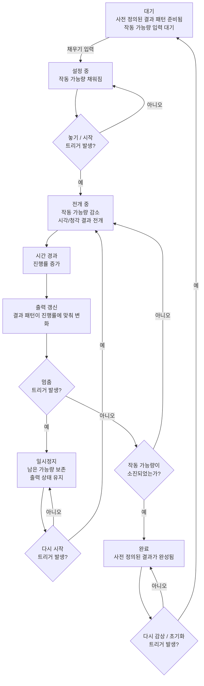

# Hourglass + Music Box 추상화/플로우차트 v0.3

## 추상화 모델 한 줄 문장

사전에 정의된 시각적/청각적 결과를 가지고 있으며, 특정 입력으로 작동 가능량을 채운 뒤 일정 시간에 걸쳐 그 가능량을 소모하며 결과를 완성하는 시스템.

## 추상화 모델을 이루는 요소

- A. 시스템 안에는 감상 가능한 시각적/청각적 결과 패턴이 사전에 정의되어 있다.
- B. 특정 트리거에 의해 작동 가능량이 채워지거나 설정된다.
- C. 다른 트리거에 의해 작동 가능량 설정이 중단되고 결과 전개가 시작된다.
- D. 시간이 흐르면서 작동 가능량은 줄어들고 진행률은 증가한다.
- E. 진행률에 따라 사전에 정의된 시각적/청각적 결과가 함께 변화한다.
- F. 작동 가능량이 모두 소진되면 결과가 완성된 상태로 멈춘다.

## UI 상태

| 상태 | 설명 |
|---|---|
| 대기 | 사전 정의된 결과 패턴은 준비되어 있고, 작동 가능량 입력을 기다리는 상태. |
| 설정 중 | 결과 패턴이 선택되고, 작동 가능량이 채워지거나 설정되는 상태. |
| 전개 중 | 작동 가능량이 줄어들고 진행률이 증가하면서 시각적/청각적 결과가 펼쳐지는 상태. |
| 일시정지 | 남은 작동 가능량과 현재 출력 상태를 유지한 채 전개를 멈춘 상태. |
| 완료 | 작동 가능량이 소진되어 사전에 정의된 결과가 완성된 상태. |

## 상태 전환 시나리오

1. 시스템에는 `predefined_result_rule`이 이미 정해져 있다.
2. 사용자가 채우기 입력을 하면 `stored_potential`이 증가하거나 설정된다.
3. 사용자가 놓기 또는 시작 입력을 하면 `stored_potential`이 확정되고 전개 중 상태로 넘어간다.
4. 시간이 흐를 때마다 `remaining_potential`은 줄고 `progress_position`은 앞으로 이동한다.
5. `progress_position`이 바뀌면 시각적 출력과 청각적 출력이 `output_mapping_rule`에 맞춰 함께 변화한다.
6. 멈춤 입력이 발생하면 현재 출력 상태를 유지한 채 일시정지하고, 다시 시작 입력이 발생하면 전개를 이어간다.
7. `remaining_potential`이 `completion_threshold` 이하가 되면 완료 상태가 되고, 사용자가 초기화하면 다시 대기 상태로 돌아간다.

## Mermaid Flowchart

<!-- HUMANIZE-SUMMARY
원본 글자수: 약 2200
윤문본 글자수: 약 2100
변경률: 약 10%
카테고리별 탐지: E-2 동일 종결 반복 -> 완화, H-3 메타 진입 표현 -> 제거
자체검증: 6/6 통과
등급: A
사유: 결과 선택 단계를 제거하고, 사전 정의된 결과와 작동 가능량 입력을 분리함.
주요 변경:
- "결과 패턴 선택" 단계를 제거
- 대기 상태를 "사전 정의된 결과 패턴 준비됨 / 작동 가능량 입력 대기"로 수정
- 플로우차트를 대기 -> 설정 중 -> 전개 중으로 단순화
-->
