# Engineering 4주차 과제: 이미지 제텔카스텐 관찰 카드 제작 자동화

## 대상 주제 선정

평소 오프라인이나 온라인에서 눈에 띄는 디자인/조형 이미지를 수집하고, 크롭/조정한 뒤, 메타데이터 또는 출처 정보와 관찰 내용을 기록하여 정해진 시각 템플릿에 배치하는 과정을 자동화한다.

짧은 이름: 이미지 제텔카스텐 관찰 카드 제작 자동화

## 프로세스 수행 기록

### 수행 기록 1

길을 가다가 인상적인 재질 위에 페인트로 로고를 그린 간판을 마주했다. 멈춰서 휴대폰 기본 카메라 앱을 켜고, 로고와 재질이 잘 보이도록 줌해서 사진을 찍었다. 집으로 돌아온 뒤 컴퓨터를 켜고, 휴대폰에서 에어드랍으로 사진을 옮겼다. 옮긴 사진을 Figma에 올리고, 원하는 조형이 잘 보이도록 위치를 조정하고 크롭했다. 그 옆에 메모를 작성했다. 촬영 날짜는 기억이 헷갈려 이미지 메타데이터를 확인했고, 당시 어떤 인상을 받았는지 기억을 더듬어 요소, 구성, 상태, 맥락, 효과를 기록했다. 이후 작성된 메모와 사진을 프린트 가능한 PPT 템플릿에 다시 옮기고, 디자인 요소들을 배치했다.

### 수행 기록 2

핀터레스트를 보다가 색 조합과 여백 배치가 마음에 드는 그래픽 이미지를 발견했다. 이미지를 그냥 넘기면 다시 찾기 어려울 것 같아 저장하거나 스크린샷을 찍었다. 이후 컴퓨터에서 해당 이미지를 열고 Figma에 올렸다. 이미지 안에서 내가 관찰하고 싶은 조형 요소가 잘 보이도록 위치를 조정하고 크롭했다. 이미지가 온라인에서 발견된 것이기 때문에 촬영 날짜 대신 발견 날짜, 출처 링크, 저장 위치를 기록했다. 그리고 왜 이 이미지가 눈에 들어왔는지, 어떤 요소와 구성 때문에 좋게 느껴졌는지, 어떤 맥락에서 참고할 수 있을지 메모를 작성했다. 마지막으로 사진과 메모를 프린트 가능한 PPT 템플릿에 다시 배치했다.

이 과정에서도 수행 기록 1과 비슷한 문제가 있었다. 이미지를 발견한 순간에는 인상이 선명하지만, 저장한 뒤 나중에 정리하려고 하면 왜 저장했는지 흐려진다. 또한 핀터레스트, 스크린샷/저장 폴더, Figma, PPT를 오가며 같은 이미지를 반복해서 옮기고 다시 배치해야 했다.

## 현재까지 확인한 자동화 문제

이미지를 발견한 순간부터 템플릿 카드가 완성되기까지, 앱 전환, 파일 저장/전달, 크롭, 메타데이터 또는 출처 확인, 메모 작성, PPT 재배치가 반복된다.

## 분해: 고수준-중수준-저수준-데이터 플로우차트

고수준 과업은 다음과 같다.

오프라인 또는 온라인에서 발견한 디자인/조형 이미지를 이미지 제텔카스텐 관찰 카드로 제작한다.

```mermaid
flowchart TD
    A["고수준 과업<br/>이미지 제텔카스텐 관찰 카드 제작"]

    A --> B["중수준 1<br/>발견"]
    B --> B1["저수준<br/>눈에 띄는 디자인/조형을 마주친다"]
    B1 --> B1D["데이터<br/>발견 대상"]
    B --> B2["저수준<br/>왜 눈에 띄었는지 순간적으로 판단한다"]
    B2 --> B2D["데이터<br/>첫인상, 관심 이유"]

    A --> C["중수준 2<br/>이미지 수집"]
    C --> C1["저수준<br/>오프라인이면 카메라 앱을 열고 촬영한다"]
    C1 --> C1D["데이터<br/>원본 사진, 촬영 날짜, 촬영 위치"]
    C --> C2["저수준<br/>온라인이면 이미지를 저장하거나 스크린샷한다"]
    C2 --> C2D["데이터<br/>원본 이미지, 발견 날짜, 출처 링크, 저장 위치"]

    A --> D["중수준 3<br/>작업 환경 준비"]
    D --> D1["저수준<br/>이미지 파일을 작업 가능한 위치로 옮기거나 연다"]
    D1 --> D1D["데이터<br/>이미지 파일, 파일 위치"]
    D --> D2["저수준<br/>Figma/PPT 등 작업 도구를 연다"]
    D2 --> D2D["데이터<br/>작업 도구, 작업 파일"]

    A --> E["중수준 4<br/>관찰 이미지화"]
    E --> E1["저수준<br/>이미지를 Figma에 올린다"]
    E1 --> E1D["데이터<br/>작업 중 이미지"]
    E --> E2["저수준<br/>관심 있는 조형이 잘 보이도록 위치를 조정한다"]
    E2 --> E2D["데이터<br/>조정된 이미지 위치"]
    E --> E3["저수준<br/>필요 없는 부분을 크롭한다"]
    E3 --> E3D["데이터<br/>크롭 영역, 정제된 이미지"]

    A --> F["중수준 5<br/>정보 확인"]
    F --> F1["저수준<br/>오프라인 사진의 메타데이터를 확인한다"]
    F1 --> F1D["데이터<br/>촬영 날짜, 촬영 위치, 파일 정보"]
    F --> F2["저수준<br/>온라인 이미지의 출처와 발견 정보를 확인한다"]
    F2 --> F2D["데이터<br/>발견 날짜, 출처 링크, 저장 위치"]

    A --> G["중수준 6<br/>기억 복원 및 관찰 기록"]
    G --> G1["저수준<br/>발견 당시 왜 멈췄는지 또는 왜 저장했는지 떠올린다"]
    G1 --> G1D["데이터<br/>기억, 판단 근거, 감정"]
    G --> G2["저수준<br/>요소, 구성, 상태, 맥락, 효과를 작성한다"]
    G2 --> G2D["데이터<br/>관찰 문장"]

    A --> I["중수준 7<br/>주제 부여 및 묶기"]
    I --> I1["저수준<br/>관찰 기록에서 반복되는 특징을 찾는다"]
    I1 --> I1D["데이터<br/>반복 특징, 키워드"]
    I --> I2["저수준<br/>카드 제목과 주제 태그 후보를 만든다"]
    I2 --> I2D["데이터<br/>제안 제목, 제안 주제 태그"]
    I --> I3["저수준<br/>사용자가 제목과 주제 태그를 선택하거나 직접 수정한다"]
    I3 --> I3D["데이터<br/>확정 제목, 확정 주제 태그"]
    I --> I4["저수준<br/>비슷한 이미지 카드끼리 묶는다"]
    I4 --> I4D["데이터<br/>카드 묶음"]

    A --> H["중수준 8<br/>출력 템플릿 제작"]
    H --> H1["저수준<br/>이미지와 메모를 PPT 템플릿에 옮긴다"]
    H1 --> H1D["데이터<br/>카드 구성 요소"]
    H --> H2["저수준<br/>디자인 요소를 배치하고 프린트 가능한 형태로 정리한다"]
    H2 --> H2D["데이터<br/>출력용 관찰 카드"]
```



## 패턴 인식

두 수행 기록은 출발점이 다르다. 수행 기록 1은 오프라인에서 실제 간판을 발견하고 촬영하는 경우이고, 수행 기록 2는 온라인에서 이미지를 발견하고 저장하거나 스크린샷하는 경우이다. 그러나 두 기록 모두 발견한 이미지를 관찰 가능한 자료로 정제하고, 정보와 관찰 문장을 붙인 뒤, 출력용 카드로 만든다는 반복 구조를 가진다.

### 반복 과업 비교

| 반복 패턴 과업 | 수행 기록 1: 오프라인 간판 | 수행 기록 2: 온라인 이미지 | 입력 데이터 | 출력 데이터 |
|---|---|---|---|---|
| 이미지 발견 | 길에서 재질과 페인트 로고가 인상적인 간판을 발견 | 핀터레스트에서 색 조합과 여백 배치가 좋은 그래픽 발견 | 주변 환경 또는 온라인 피드 | 발견 대상, 첫인상 |
| 이미지 수집 | 휴대폰 카메라로 줌해서 촬영 | 이미지 저장 또는 스크린샷 | 발견 대상 | 원본 이미지 |
| 작업 환경으로 이동 | 현장에서 집 또는 컴퓨터가 있는 장소로 이동 | 이미 컴퓨터/온라인 작업 환경에 있으므로 생략 | 현장 상황, 휴대폰 속 원본 사진 | 컴퓨터 작업 가능 상태 |
| 작업 파일 준비 | 휴대폰 사진을 컴퓨터로 에어드랍 | 저장 파일/스크린샷을 컴퓨터에서 확인 | 원본 이미지 | 작업 가능한 이미지 파일 |
| 관찰 이미지화 | Figma에서 조형이 잘 보이도록 이동/크롭 | Figma에서 조형 요소가 잘 보이도록 이동/크롭 | 작업 가능한 이미지 파일 | 정제된 이미지 |
| 정보 확인 | 이미지 메타데이터로 촬영 날짜 확인 | 발견 날짜, 출처 링크, 저장 위치 확인 | 이미지 파일 또는 출처 | 날짜, 출처, 파일 정보 |
| 기억 복원 | 당시 어떤 인상을 받았는지 떠올림 | 왜 저장했는지, 어떤 점이 좋았는지 떠올림 | 발견 대상, 첫인상, 정제된 이미지 | 판단 근거, 감정, 맥락 |
| 관찰 기록 | 요소, 구성, 상태, 맥락, 효과를 기록 | 요소, 구성, 상태, 맥락, 효과를 기록 | 정제된 이미지, 정보, 판단 근거 | 관찰 문장 |
| 주제 부여 및 묶기 | 관찰 문장에서 비슷한 특징을 찾아 제목/태그 후보를 만들고 기존 카드와 연결 | 관찰 문장에서 비슷한 특징을 찾아 제목/태그 후보를 만들고 기존 카드와 연결 | 관찰 문장, 기존 카드 목록 | 제안 제목, 제안 주제 태그, 카드 묶음 |
| 제목/주제 확정 | 제안된 제목과 태그를 선택하거나 직접 수정 | 제안된 제목과 태그를 선택하거나 직접 수정 | 제안 제목, 제안 주제 태그, 사용자의 판단 | 확정 제목, 확정 주제 태그 |
| 출력 템플릿 배치 | 사진, 메모, 제목, 태그를 PPT 템플릿에 배치 | 이미지, 메모, 제목, 태그를 PPT 템플릿에 배치 | 정제된 이미지, 정보, 관찰 문장, 확정 제목, 확정 주제 태그 | 출력용 관찰 카드 |

### 발견한 반복 패턴

1. 이미지를 발견한 순간에는 인상이 선명하지만, 기록은 나중에 이루어진다.
   - 이 간격 때문에 왜 이 이미지를 찍었는지 또는 저장했는지가 흐려진다.

2. 이미지 원본은 항상 관찰 가능한 이미지로 한 번 정제된다.
   - 원본 그대로 쓰는 것이 아니라, 관심 있는 조형 요소가 보이도록 크롭하거나 위치를 조정한다.

3. 이미지에는 항상 부가 정보가 붙는다.
   - 오프라인 이미지는 촬영 날짜 같은 메타데이터가 필요하다.
   - 온라인 이미지는 발견 날짜, 출처 링크, 저장 위치가 필요하다.

4. 관찰 기록은 같은 질문 구조를 반복한다.
   - 요소
   - 구성
   - 상태
   - 맥락
   - 효과

5. 관찰 기록이 쌓이면 비슷한 이미지끼리 제목과 주제 태그를 부여하고 묶는 과정이 반복된다.
   - 요소, 구성, 상태, 맥락, 효과 기록에서 반복되는 키워드나 판단 근거를 찾는다.
   - 시스템은 제목과 주제 태그를 제안하고, 사용자는 선택하거나 직접 수정한다.
   - 비슷한 특징을 가진 카드끼리 연결하면 나중에 자신의 미적 기준을 더 쉽게 확인할 수 있다.

6. 오프라인에서 발견한 이미지는 작업 환경으로 이동하는 단계가 추가된다.
   - 길거리에서 이미지를 발견하고 촬영하는 순간에는 Figma나 PPT 작업을 할 수 없기 때문에, 집이나 컴퓨터가 있는 장소로 이동하는 과정이 필요하다.
   - 온라인에서 발견한 이미지는 이미 컴퓨터/온라인 작업 환경 안에서 발견되는 경우가 많기 때문에 이 단계가 생략된다.

7. 최종 결과물은 항상 정해진 템플릿에 배치된다.
   - 이미지와 텍스트를 따로 관리하는 것이 아니라, 프린트 가능한 카드 형태로 정리한다.

### 패턴 인식 결론

반복되는 핵심 패턴은 다음과 같다.

오프라인이든 온라인이든, 눈에 띈 이미지는 원본 이미지로 수집된 뒤, 관찰하기 좋은 형태로 정제되고, 날짜/출처 정보와 관찰 문장이 붙는다. 이후 관찰 기록을 바탕으로 카드 제목과 주제 태그가 제안되고, 사용자가 이를 선택하거나 수정한 뒤, 비슷한 이미지끼리 묶이고 정해진 출력 템플릿 카드로 변환된다.

짧게 표현하면 다음과 같다.

```text
이미지 발견
→ 이미지 수집
→ 관찰 이미지화
→ 정보 확인
→ 관찰 기록
→ 제목/주제 태그 제안
→ 제목/주제 태그 선택 또는 수정
→ 유사 카드 묶기
→ 템플릿 배치
```

## 추상화: input-activity-output 모듈

패턴 인식에서 발견한 반복 과업 중 자동화할 부분만 규격화된 모듈로 정의한다. 발견 자체는 사용자가 수행하고, 프로토타입은 수집 모듈부터 시작한다.

| 모듈 | Input | Activity | Output |
|---|---|---|---|
| 수집 모듈 | 사용자가 발견한 오프라인/온라인 이미지 | 이미지 업로드, 저장 이미지 선택, 출처 입력을 받는다 | 원본 이미지, 임시 출처 정보 |
| 관찰 이미지화 모듈 | 원본 이미지 | 크롭, 위치 조정, 보기 좋은 영역 선택을 수행한다 | 정제된 이미지, 크롭 영역 |
| 정보 자동 수집 모듈 | 원본 이미지, 정제된 이미지, 파일 정보, 출처 URL | 촬영 날짜, 발견 날짜, 파일명, 출처 링크 등 가능한 정보를 자동으로 모은다 | 이미지 정보 |
| 관찰 기록 모듈 | 정제된 이미지, 이미지 정보, 사용자의 첫인상 | 요소, 구성, 상태, 맥락, 효과 질문에 맞춰 기록을 작성하게 한다 | 관찰 문장 |
| 제목/주제 제안 모듈 | 관찰 문장, 이미지 정보, 기존 카드 목록 | 반복되는 키워드와 유사한 관찰 기록을 찾아 제목과 주제 태그를 제안한다 | 제안 제목, 제안 주제 태그, 유사 카드 후보 |
| 제목/주제 확정 모듈 | 제안 제목, 제안 주제 태그, 사용자의 판단 | 사용자가 제안을 선택하거나 직접 수정한다 | 확정 제목, 확정 주제 태그 |
| 유사 카드 묶기 모듈 | 확정 주제 태그, 관찰 문장, 기존 카드 목록 | 비슷한 특징을 가진 카드와 연결한다 | 카드 묶음 |
| 템플릿 배치 모듈 | 정제된 이미지, 이미지 정보, 관찰 문장, 확정 제목, 확정 주제 태그 | 정해진 카드 템플릿에 이미지와 텍스트를 배치한다 | 출력용 관찰 카드 |

## 프로토타입 설명 초안

이 프로토타입은 오프라인 또는 온라인에서 발견한 디자인/조형 이미지를 이미지 제텔카스텐 관찰 카드로 만드는 도구이다. 사용자는 먼저 직접 촬영한 사진이나 온라인에서 저장한 이미지를 업로드한다. 이미지를 업로드하면 시스템은 원본 이미지를 화면에 보여주고, 사용자가 관찰하고 싶은 부분이 잘 보이도록 크롭하거나 위치를 조정할 수 있게 한다.

이미지가 관찰 가능한 형태로 정리되면, 시스템은 이미지 파일에서 확인 가능한 정보를 자동으로 불러온다. 오프라인에서 촬영한 사진이라면 촬영 날짜나 파일 정보를 가져오고, 온라인에서 저장한 이미지라면 사용자가 입력한 출처 링크나 발견 날짜를 함께 기록한다. 이 정보는 나중에 왜 이 이미지를 수집했는지 다시 확인할 수 있는 기본 메타데이터가 된다.

다음으로 사용자는 이미지에 대한 관찰 기록을 직접 작성한다. 기록 항목은 요소, 구성, 상태, 맥락, 효과로 나뉜다. 사용자는 각 항목에 대해 짧은 문장을 입력하고, 시스템은 이 내용을 하나의 관찰 메모로 묶는다. 이 단계의 목적은 이미지를 단순히 저장하는 것이 아니라, 사용자가 무엇을 보고 어떤 판단을 했는지 스스로 언어화하는 것이다. 따라서 관찰 기록은 시스템이 대신 작성하지 않는다.

관찰 기록이 작성되면, 시스템은 기록된 문장에서 반복되는 키워드나 조형적 특징을 찾아 카드 제목과 주제 태그를 제안한다. 예를 들어 색 대비, 거친 재질, 비정형 배치, 낮은 채도, 과한 장식 같은 태그가 생성될 수 있다. 제목과 주제 태그는 확정값이 아니라 제안값이다. 사용자는 제안된 제목과 태그를 선택할 수도 있고, 선택하지 않을 수도 있으며, 직접 수정하거나 새로 입력할 수도 있다. 이미 저장된 카드가 있다면 새 카드와 비슷한 관찰 기록을 가진 카드를 함께 보여주어, 사용자가 비슷한 이미지들을 하나의 묶음으로 연결할 수 있게 한다.

마지막으로 시스템은 정제된 이미지, 메타데이터, 관찰 기록, 제목, 주제 태그를 정해진 시각 템플릿에 자동으로 배치한다. 사용자는 템플릿 안에서 이미지와 텍스트가 카드 형태로 정리된 결과물을 확인하고, 필요하면 간단히 수정한 뒤 저장하거나 출력용 이미지로 내보낼 수 있다.

이 프로토타입이 자동화하는 핵심은 미감 판단 자체가 아니다. 사용자가 이미지를 발견하고 느끼는 일, 그리고 관찰 내용을 직접 쓰는 일은 사용자의 몫으로 남긴다. 대신 이미지 수집 이후 반복되는 크롭, 정보 확인, 관찰 항목 정리, 제목/주제 태그 제안, 유사 카드 묶기, 템플릿 배치 과정을 하나의 공정으로 묶어, 미감 훈련 기록이 계속 쌓일 수 있게 한다.

### 프로토타입 모듈 흐름

```text
이미지 업로드
→ 크롭/위치 조정
→ 메타데이터/출처 정보 기록
→ 요소·구성·상태·맥락·효과 직접 작성
→ 제목/주제 태그 제안
→ 사용자가 제목/주제 태그 선택 또는 직접 수정
→ 유사 카드 묶기
→ 카드 템플릿 자동 배치
→ 저장/출력
```
